<div align="center">
  
<!-- Animated Header -->


<br/>

<!-- Subtitle -->
<p>
  <em>AI/ML Engineer crafting end-to-end intelligent systems — from LLM agents to real-time computer vision 🚀</em>
</p>

<!-- Social Badges -->
<p>
  <a href="https://linkedin.com/in/sarthak-chauhan-32b1b325b">
    
  </a>
  <a href="mailto:sarthak4156@gmail.com">
    
  </a>
  <a href="https://github.com/CodeNinjaSarthak">
    
  </a>
  <a href="https://kaggle.com/sarthak4156">
    
  </a>
  <a href="https://www.leetcode.com/sarthak4156">
    
  </a>
</p>


</div>

---

## 🧠 About Me

```python
class SarthakChauhan:
    def __init__(self):
        self.role = "AI/ML Engineer & Researcher"
        self.education = "B.Tech CSE (AI/ML) @ Bennett University | CGPA: 9.36"
        self.location = "India 🇮🇳"
        
    def current_work(self):
        return [
            "🔬 Building RAG systems with 10K+ NCERT embeddings at Cograd",
            "🚗 YOLOv8 + dehazing for foggy traffic detection (Gov of India Project)",
            "🧬 PINNs for brain tumor growth simulation",
            "💬 Hinglish NLP with mBERT/XLM-R achieving 90% accuracy"
        ]
    
    def skills(self):
        return {
            "AI/ML": ["Deep Learning", "NLP", "Computer Vision", "RAG", "PINNs"],
            "LLM Stack": ["LangChain", "LlamaIndex", "CrewAI", "AutoGen", "LangGraph"],
            "Frameworks": ["PyTorch", "TensorFlow", "Hugging Face", "FastAPI"],
            "MLOps": ["Docker", "MLflow", "W&B", "ONNX", "TensorRT"]
        }
    
    def fun_fact(self):
        return "I think my GPU works harder than I do 😄"
```

---

## 🚀 Featured Projects

<table>
  <tr>
    <td width="50%">
      <h3 align="center">DataWhiz</h3>
      <p align="center">
        <a href="https://vsk-project.vercel.app/">
          
        </a>
      </p>
      <p><strong>Natural Language → SQL with Multi-Agent LLMs</strong></p>
      <p>🎯 92%+ accuracy on 100+ query cases<br/>⚡ 65% faster query generation via FastAPI<br/>📊 Auto-visualization with LIDA for 10K+ data points</p>
      <p><code>FastAPI</code> <code>GPT-4o</code> <code>DuckDB</code> <code>MongoDB</code> <code>LIDA</code></p>
    </td>
    <td width="50%">
      <h3 align="center">Aurigen</h3>
      <p align="center">
        <a href="https://github.com/CodeNinjaSarthak/Aurigen">
          
        </a>
      </p>
      <p><strong>AI-Powered Jewelry Design Generator</strong></p>
      <p>🎨 SDXL + ControlNet multimodal pipeline with LoRA<br/>📁 Curated 6K+ custom dataset<br/>🚀 Optimized inference with float16 & batching</p>
      <p><code>PyTorch</code> <code>Stable Diffusion XL</code> <code>ControlNet</code> <code>Streamlit</code></p>
    </td>
  </tr>
  <tr>
    <td width="50%">
      <h3 align="center">AeroPINN</h3>
      <p align="center">
        <a href="https://github.com/CodeNinjaSarthak/AeroPINN">
          
        </a>
      </p>
      <p><strong>Physics-Informed Neural Networks for Aerodynamics</strong></p>
      <p>✈️ 95% accuracy simulating airflow around airfoils<br/>⚡ 100x faster than traditional CFD (OpenFOAM)<br/>⏱️ Predictions delivered in under 1 second</p>
      <p><code>TensorFlow</code> <code>PyTorch</code> <code>NumPy</code> <code>Streamlit</code></p>
    </td>
    <td width="50%">
      <h3 align="center">RAG Content Generator</h3>
      <p align="center">
        
      </p>
      <p><strong>Enterprise RAG System @ Cograd</strong></p>
      <p>📚 10K+ NCERT embeddings in Qdrant<br/>⏰ Reduced content creation: 60min → 4min (93% faster)<br/>👥 Serving 500+ students across grades 6-12</p>
      <p><code>Qdrant</code> <code>Azure</code> <code>FastAPI</code> <code>scikit-learn</code></p>
    </td>
  </tr>
</table>

---

## 🎯 Skills

<table>
<tr>
<td width="50%" valign="top">

### 🧠 AI/ML & Research
- Machine Learning, Deep Learning
- Natural Language Processing (NLP)
- Computer Vision (YOLOv8, Dehazing, Detection)
- Transformers, LLMs, RAG Systems
- Physics-Informed Neural Networks (PINNs)
- Diffusion Models (SDXL, ControlNet)
- Optimization, Feature Engineering, Statistical Modeling

</td>
<td width="50%" valign="top">

### 🤖 LLM & Agents
- LangChain, LlamaIndex, LangGraph
- AutoGen, CrewAI, JinaAI
- Prompt Engineering & Retrieval Optimization
- Multi-Agent Systems for SQL, Automation & Pipelines
- Vector Search & Embeddings
- OpenAI API Integration

</td>
</tr>
<tr>
<td width="50%" valign="top">

### 📚 Frameworks & Libraries
- PyTorch, TensorFlow, Hugging Face
- scikit-learn, OpenCV, NumPy, Pandas
- FastAPI, Streamlit, DuckDB, MongoDB
- Qdrant, Neo4j

</td>
<td width="50%" valign="top">

### ⚙️ MLOps & Systems
- Docker, MLflow, Weights & Biases
- ONNX, TensorRT (FP16/INT8 optimization)
- Azure, GCP, Linux
- Experiment Tracking, Profiling & Deployment
- CUDA, LaTeX

</td>
</tr>
</table>

---

## 🛠️ Tech Stack

<div align="center">

### 💻 Languages


### 🧠 Deep Learning & AI


### 🤖 LLM Ecosystem


### 🚀 Backend & Deployment


### 📊 MLOps & Optimization


### 🔧 Tools


</div>

---

## 📊 GitHub Stats

<div align="center">
  <!--  -->
  <!--  -->
<!-- 
 -->

 <div align="center">



</div>

<div align="center">
  
</div>

<br/>

<!-- <div align="center">
  
</div> -->

---

## 🐍 Contribution Graph

<div align="center">
  <picture>
    <source media="(prefers-color-scheme: dark)" srcset="https://raw.githubusercontent.com/CodeNinjaSarthak/CodeNinjaSarthak/output/github-snake-dark.svg" />
    <source media="(prefers-color-scheme: light)" srcset="https://raw.githubusercontent.com/CodeNinjaSarthak/CodeNinjaSarthak/output/github-snake.svg" />
    
  </picture>
</div>

---

## 🏆 Achievements

<div align="center">

| 🥇 Hackathons | 🎓 Academic | 📜 Certifications |
|:---:|:---:|:---:|
| **Convolve 3.0 Finalist** (IIT) | **Dean's List Award** | IBM Machine Learning |
| **Amazon ML Challenge Top 1%** (70K+ participants) | CGPA: **9.36/10** | Deep Learning Specialization |
| **Kharagpur Data Science Semi-finalist** | Published @ **IC3SE 2025** | GenAI with LLMs |

</div>

---

## 📚 Research & Publications

<div align="center">

📄 **"Deep Learning-based Brain Tumor Detection"**  
*Accepted & Presented at IC3SE, 2025*

📄 **"Hinglish Abusive Comment Detection Using Transformer-Based Models"**  
*Under Review at AICAPS, 2026*

</div>

---

## 💭 Dev Quote

<div align="center">
  
</div>

---

## 🤝 Let's Connect!

<div align="center">
  
<p>I'm always excited to collaborate on innovative AI/ML projects!</p>

💼 **Open to:** Research Collaborations | Open Source | AI/ML Internships

📧 **Reach me at:** [sarthak4156@gmail.com](mailto:sarthak4156@gmail.com)

<br/>

[](https://visitcount.itsvg.in)

</div>

---

<div align="center">
  


</div>
